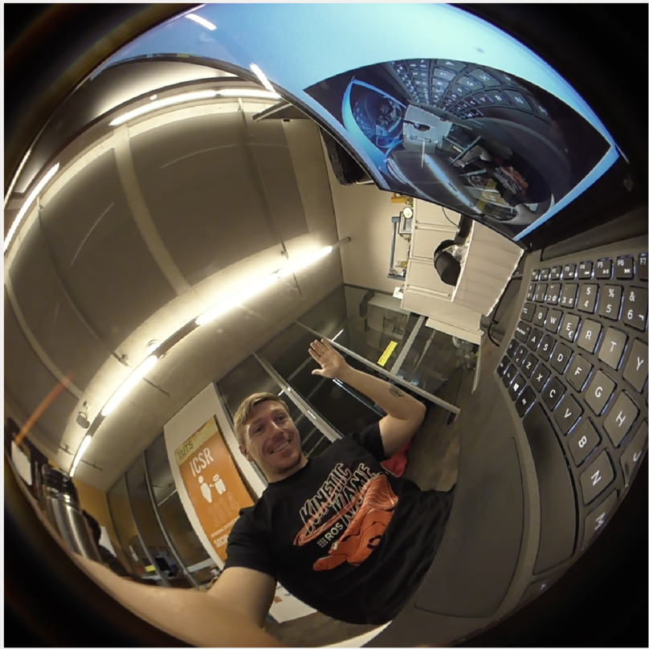
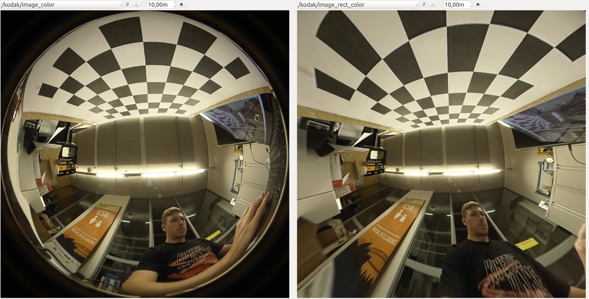
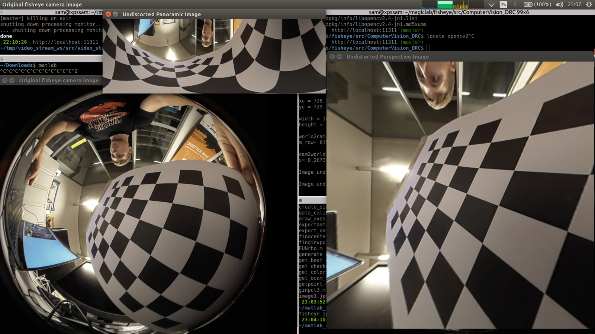

# How to use Kodak PIXPRO SP360 4k with ROS

Notes on using Kodak PIXPRO SP360 4K 360º camera with ROS.

# Enable Web Cam mode

First you'll need to enable the webcam mode of the camera when plugged with
the USB cable.

Turn it on, push the options button (under power button), push it again to move to
the general options and push OK to enter the menu. Push options 2 times more to get
to the screen that says `Mass Storage`, press OK and change it to `Web Cam`. You are done,
you can go to the EXIT option.

Now you can plug the USB cable to the camera and the computer.

# Prepare a driver package

I use [video_stream_opencv](http://wiki.ros.org/video_stream_opencv) mainly because
I wrote it. It just works. You can install it with `sudo apt-get install ros-indigo-video-stream-opencv`.

Create a launchfile (based on the original one called `webcam.launch` in `video_stream_opencv`)
called [kodak.launch](kodak.launch) with the following contents:

```xml
<launch>
   <!-- launch video stream -->
   <include file="$(find video_stream_opencv)/launch/camera.launch" >
        <!-- node name and ros graph name -->
        <arg name="camera_name" value="kodak" />
        <!-- means video device 1, /dev/video1 -->
        <arg name="video_stream_provider" value="1" />
        <!-- throttling the querying of frames to -->
        <arg name="fps" value="15" />
        <!-- setting frame_id -->
        <arg name="frame_id" value="kodak_optical_frame" />
        <!-- camera info loading, take care as it needs the "file:///" at the start , e.g.:
        "file:///$(find your_camera_package)/config/your_camera.yaml" -->
        <arg name="camera_info_url" value="" />
        <!-- flip the image horizontally (mirror it) -->
        <arg name="flip_horizontal" value="false" />
        <!-- flip the image vertically -->
        <arg name="flip_vertical" value="false" />
        <!-- force width and height, 0 means no forcing -->
        <arg name="width" value="1440"/>
        <arg name="height" value="1440" />
        <!-- visualize on an image_view window the stream generated -->
        <arg name="visualize" value="true" />
   </include>
</launch>
```

**Note** that you may need to modify `<arg name="video_stream_provider" value="1" />` to fit your `/dev/videoX` device.

**Note** that the camera works at 15fps on 1440x1440 resolution. The original 2880x2880 can't be currently used as you get:

```
libv4l2: error converting / decoding frame data: v4l-convert: error destination buffer too small (16777216 < 24883200)
VIDIOC_DQBUF: Bad address
```

# Run the driver

    roslaunch kodak.launch

You should be able to see:




# Calibration notes

## Calibration using camera_calibration package

I tried to calibrate it using the usual `rosrun camera_calibration cameracalibrator.py` tool
but as it was expected the results aren't too good.

My [kodak.yaml](kodak.yaml) calibration file resulted:

```yaml
image_width: 1440
image_height: 1440
camera_name: kodak
camera_matrix:
  rows: 3
  cols: 3
  data: [559.7772332675477, 0, 654.6891822497959, 0, 537.9001480261843, 757.5374958985061, 0, 0, 1]
distortion_model: plumb_bob
distortion_coefficients:
  rows: 1
  cols: 5
  data: [-0.1710342568253523, 0.01562344385534763, -0.006842079559350427, 0.005880933792022186, 0]
rectification_matrix:
  rows: 3
  cols: 3
  data: [1, 0, 0, 0, 1, 0, 0, 0, 1]
projection_matrix:
  rows: 3
  cols: 4
  data: [471.8281555175781, 0, 686.7856496391687, 0, 0, 427.0946044921875, 763.6798197288299, 0, 0, 0, 1, 0]
```

So using:

    ROS_NAMESPACE=kodak rosrun image_proc image_proc

Yields this:



## Using OcamCalib

Using Davide Scaramuzza's [OcamCalib v3.0](https://sites.google.com/site/scarabotix/ocamcalib-toolbox) 
I got a little bit of better results.

My [calib_results_kodak.txt](calib_results_kodak.txt) looks like:

```
#polynomial coefficients for the DIRECT mapping function (ocam_model.ss in MATLAB). These are used by cam2world

5 -2.716972e+02 0.000000e+00 -2.741744e-06 1.840940e-06 -8.024838e-10 

#polynomial coefficients for the inverse mapping function (ocam_model.invpol in MATLAB). These are used by world2cam

13 583.439624 470.805865 97.165132 120.712689 100.686168 55.067847 67.348203 15.186683 1.492255 84.459767 105.607698 48.090642 7.785426 

#center: "row" and "column", starting from 0 (C convention)

728.648728 729.090632

#affine parameters "c", "d", "e"

1.001407 -0.000818 0.000221

#image size: "height" and "width"

1440 1440
```

And when playing around with [undistortFunctions](http://rpg.ifi.uzh.ch/software/ocamcalib/undistortFunctions.zip) with my results and [my images](ocamcalib_images) I got this:



Which looks way better, but I think it can be improved.

# ToDo's

* Make a better calibration.
* Make/Find a ROS node to publish the rectified image with OcamCalib calibration.
* Make a virtual camera package when having the rectified image to
republish a subpart of the image, maybe with pan-tilt commands as drones do.
* Find out packages to play with, SVO probably, altho it does not accept OcamCalib format...

